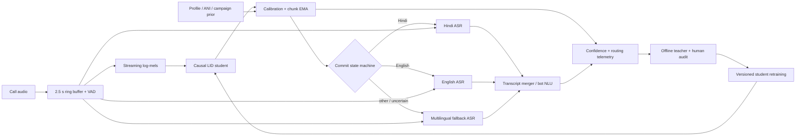

# Part 2 — streaming LID in a live ASR pipeline

The LID model should advise a stateful router, not directly restart ASR on every posterior peak. Audio is written once to a timestamped ring buffer; VAD, LID, and the active recognizer consume that same clock. This makes a routing decision reversible because a new recognizer can replay recent audio.



## Commit and calibration policy

Each input call (normally 160 ms; the final call may be shorter) returns its absolute stable-output range, received-feature boundary, and a post-inference monotonic timestamp; the policy trace derives the exclusive latest-audio sample from that boundary. The streaming model retains its final four feature positions until their real right context arrives and emits each position once; zero-padded end-of-stream tail logits never enter the router. After any temperature/vector calibration learned on speaker-disjoint, codec-matched calls, the policy averages only the delay-valid outputs within that actual call, never a new 16-frame slice of concatenated logits, and updates an EMA. An initial commit requires all three conditions: top posterior at least 0.60, top-minus-runner-up margin at least 0.10, and the same winner for three consecutive emission groups (nominally three 160 ms calls). Before that, the state is `UNKNOWN`; audio remains buffered and a multilingual recognizer may run in shadow.

For the recorded 798-feature-frame Hindi→English replay, the scheduler makes 50 calls and emits 794 stable logits. Dropping outputs before the 21-frame label delay leaves 773 logits in 49 policy groups: the first group is the 7 valid frames from output range `[12, 28)`, becomes audio-available at sample 5,360 (0.335 s), and later full groups contain 16 frames. The old concatenate-and-reslice reconstruction placed its first group at 0.375 s and changed group posteriors by mean/max L1 0.1864/0.4707. `eval_metrics.json` retains every call record. Its monotonic values time offline feature replay completion only; feature extraction is still whole-waveform and `incremental_frontend_included=false`, so these are not end-to-end ingress timestamps.

The submitted thresholds are illustrative, not fitted on one synthetic switch. On a real development set I would grid-search threshold, margin, EMA constant, and dwell against expected business cost rather than accuracy alone:

```text
cost = C_wrong * P(wrong route) + C_wait * initial_latency
     + C_switch * switches/hour + C_miss * P(missed language).
```

Reliability diagrams and expected calibration error should be sliced by language pair, SNR, codec, utterance length, and prior. Select an operating point subject to hard bounds on false routes and p95 latency. A payment bot may wait longer than a low-risk FAQ bot. Model algorithmic latency here is 435 ms; EMA/dwell and evidence acquisition are separately visible in telemetry rather than being hidden in that number.

## Routing and the cost of changing ASR

At call start, retain at least 2.5 s of waveform. A strong prior may start one monolingual ASR speculatively, while weak confidence starts the multilingual fallback. On LID commit, send the buffered audio from the VAD onset to the selected ASR, so waiting does not delete the first words. Do not release irreversible bot actions until either the route is committed or the fallback transcript is stable.

Changing ASR is not a pointer swap. Decoder state, language-model context, endpointing, punctuation, timestamps, and partial hypotheses belong to the old recognizer. A switch therefore:

1. freezes already stable words before a protected overlap boundary;
2. starts the new ASR with roughly 0.8–1.5 s of buffered overlap;
3. re-decodes that overlap and merges by timestamps/token confidence;
4. retires the old ASR only after the new stream catches up.

Running both ASRs continuously reduces switch latency but roughly doubles inference cost. The preferred compromise is one active monolingual model plus a cheap multilingual shadow during `UNKNOWN` or suspected switches. A wrong early commit costs the original wait, new-model startup, overlap re-decode, and possibly a bad NLU action—often much more than another 200–400 ms of LID dwell.

## Code-switch hysteresis and measurement

Once active language `A` is committed, retain it until challenger `B` meets a stricter switch condition. The current example uses posterior ≥0.60, a ≥0.10 advantage over `A`, and three consecutive chunks. A failed chunk resets the challenger dwell counter; it does not immediately flip the active state. A short cooldown after switching and asymmetric thresholds for known hard pairs can reduce ping-pong. Silence does not vote: during non-speech, freeze or decay toward `UNKNOWN` rather than toward an arbitrary language.

For a hand-labelled boundary at `t_boundary`, switch lag is

```text
lag = t(first committed new-language decision) - t_boundary.
```

Use the audio-ingress clock, including chunk scheduling—not model frame indices. In the current offline evaluator, audio availability is the exact exclusive end sample of the latest feature received by each real call; the separately recorded monotonic clock is explicitly not an ingress clock. Report median/p90/p95 lag, miss rate within (say) 3 s, premature-switch rate, false switches per speech hour, and time spent on the wrong ASR. Negative raw crossings are premature detections, not “excellent lag.” In the submitted speaker-disjoint run, the student never satisfies the initial Hindi dwell and never commits English after the 4.000 s boundary; `switch_lag_ms` is therefore `null` and the case is a miss. It is not encoded as zero or an arbitrarily large lag. One synthetic boundary is only a wiring check.

## Low confidence, priors, and fallback

Convert a phone-number, customer-profile, campaign, or last-turn language prior into a calibrated log-prior and add it with a capped weight to LID log probabilities. Decay its influence after the first seconds of speech so acoustic evidence wins; never hard-lock a user based on ANI. Priors should be audited by cohort because an incorrect prior can systematically delay a switch.

If confidence/margin never passes policy, route to a multilingual ASR, keep buffering, and let ASR confidence plus LID make a joint decision. For high-value flows, ask a short language-choice reprompt. Treat high entropy, low energy, overlapping speakers, and low mass inside the supported-language set as `UNKNOWN`. A production student needs an explicit `other/unknown` class; the demo's seven-way renormalization cannot provide that safety signal.

## Teacher-relabel loop

Log consented, privacy-filtered segments when LID is uncertain, ASR confidence collapses after routing, two recognizers disagree, users correct the bot, or frequent switches occur. Preserve audio timestamps, LID trajectories, route changes, codec/SNR, and downstream outcomes. Offline, run the full-context teacher on VAD utterances for stationary speech and on local windows around suspected switches. Never apply one utterance label across a code-switch. Sample low-confidence/OOD cases for bilingual human audit; teacher labels are not ground truth.

Before another retrain, audit the teacher distribution under the exact loss mask and ramp rather than equating balanced clip counts with balanced supervision. Target-cache schema 6 binds a recomputable 71-clip ledger with selected seven-way and native 107-way top-1 evidence, integer per-class confusions, T=1/T=2 label probability, retained selected-language mass, provider/voice counts, valid frames, ramp weights, and aggregate class mass. The current corpus has ten monolingual clips per class, but English is only 6/10 selected-top-1-correct and receives 6.5290% of T=2 target mass, versus 10/10 and 20.6489% for Hindi. An explicit 8/10 correctness floor therefore fails English only. Missing or inconsistent audit evidence is a cache error; the observed floor failure is published as diagnostic evidence so the flawed baseline remains reproducible, while blocking any balanced-supervision or promotion claim until the English failure is controlled.

Version audio recipes and hashes, teacher checkpoint, target parameters, calibration set, and policy. The demo's corpus builder binds text/provider/voice/options/client and generator identity to each byte-addressed WAV, validates the complete staged corpus, moves immutable audio first, and atomically swaps the manifest last; a failed refresh cannot partially rewrite the release named by the old manifest. Downstream stages fail closed on a changed target class order, manifest record, waveform hash, target-configuration/file-set hash, pinned teacher revision/artifacts, or target-generator source. Before importing Torch or project modules, the train/eval launchers copy the complete local Python package and entry points plus project/lock files into a content-addressed, read-only-requested source tree, start a fresh child with the editable workspace removed from local import paths, and bind every package module origin and runtime version to source schema 1. Run-identity schema 4 then captures `manifest.jsonl` exactly once before any data consumer or tensor preload. That immutable value retains the raw bytes, exact-file SHA-256, canonical 94-record bytes/digest, record count, and base directory; speaker audit, target cache, corpus identity, dataset, training, and evaluation receive defensive record copies from it. Root, corpus, and target-cache identities must carry the same exact and canonical manifest digests, so an A/B/A pathname sequence fails before preload. Five training and two evaluation stage checks reject changed/missing/extra/symlinked source, while three live dependency gates—before preload, before optimization, and before checkpoint publication—compare the mutable paths with the launch snapshot and abort on drift without changing the already-consumed generation. The final identity adds all 94 audio hashes, target metadata, model/checkpoint hash, complete frontend/model/delay/chunk configuration, and exact checkpoint-bound training metrics; evaluation captures one manifest generation independently and refuses mixed-run inputs before scoring. Target-cache schema 6 stores the exact manifest binding, raw and `T=2` softened anchors, native-teacher summaries, and the hashed training audit; it reconstructs all 41,195 dense raw/soft frames under the declared expansion within `rtol=1e-6, atol=2e-7`, and rejects a causal ledger paired with unrelated dense tensors or a self-rehashed forged audit. For switch targets it additionally records semantic, bracketing, and source-anchor frames plus unclipped teacher/student latest-sample clocks; every strict load recomputes the ledger and requires `teacher_latest <= student_latest`, which all 2,394 switch frames pass including padded final edges. These checks remove future-anchor leakage and bind the actual training tensors to that claim, but they do not make the slow teacher trajectory a good switch target. The policy trace separately binds each emitted group to the actual streaming call that produced it and rejects discontinuous ranges or clocks that move backward. Training rejects any batch with no causally valid alignment, non-positive/non-finite run settings, and an optimizer update that leaves non-finite model or optimizer state. The submitted run records 1,600 requested, successful, and post-update-checked real-audio steps; a zero-gradient, corrupt update, or source/data race cannot become a published success flag. Capture the full training trajectory, shortlist against frozen development criteria, and validate the shortlist on untouched external development data before replacing the authoritative checkpoint. The current five-state FLEURS-validation diagnostic retains step 1,600: selected step 800 gains only 0.38 points, its stored unadjusted descriptive interval is [-0.48, +1.24] points, every candidate has zero worst-language composite, and all miss both local switches. Because the interval independently resamples repeated prefix views after adaptive five-state selection, it is not a confirmatory 95% coverage statement; clustered sensitivity checks also span zero. The run's reused ECAPA cache is internally coherent but does not bind its producing source/runtime/language mapping, so its exact teacher-control values have incomplete producer provenance. The checkpoint rejection remains supported independently because the 0.38-point gain misses the predeclared +2-point gate. Retrain with a balanced mixture of recent hard cases and a fixed replay set, then gate release on absolute per-language agreement, calibration, false switches/hour, switch-lag percentiles, and downstream ASR WER/task success. Shadow the candidate, canary a small call fraction, and retain rollback. This closes the loop without allowing the student's own mistakes to become self-confirming labels.
