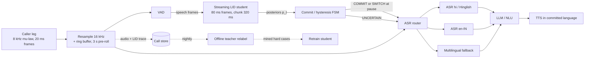
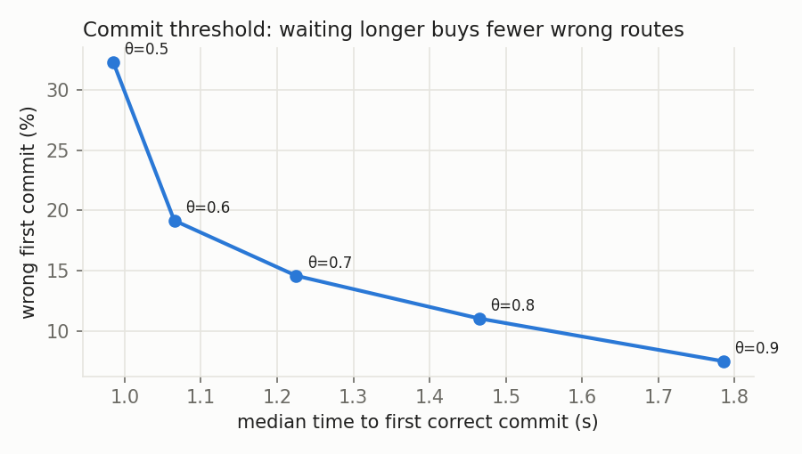

# Part 2: Streaming LID in front of ASR

All numbers come from `results/` and are produced by the scripts named next to them. The switches are synthetic concatenations of held-out clips.

## 1. Where it sits

The LID runs only on the caller's inbound track (never the bot's own TTS or echo), and only on VAD speech frames, so silence cannot move the decision.

## 2. Commit and calibration policy

The student emits a posterior every 80 ms frame. Raw argmax is jittery, so routing reads a small state machine (`slid/commit.py`, tested in `tests/test_commit.py`):

- **Smoothing:** s_t = (1 − α) s_{t−1} + α p_t, with α = 0.3 (≈ 0.25 s time constant).
- **First commit:** when max_k s_tk ≥ θ_commit (0.8, chosen from the sweep below; the code default and the README evaluation tables use 0.7). Until then the call is *uncommitted* and routes to the prior (section 5).
- **Switch:** a different language must reach θ_switch = θ_commit + 0.1 for `dwell` consecutive frames (3 = 240 ms), and the router only acts on it at the next pause or endpoint.

**Why these three knobs:**
- A threshold alone flip-flops near 0.5.
- A margin (top-1 minus top-2) is equivalent for 2 classes, but less interpretable with 7.
- Dwell time is what actually suppresses one-frame blips.
- θ_switch > θ_commit is the hysteresis: once committed, it takes stronger evidence to leave than it took to enter.

**How to set the operating point.** This is a cost trade-off, not a number to guess:
- **Cost of a wrong commit:** the ASR decodes the turn in the wrong language, so the transcript is garbage. The bot either answers nonsense or re-prompts (several seconds plus user frustration).
- **Cost of waiting:** each extra 100 ms before commit is 100 ms of audio buffered and decoded late.

The procedure, on a labelled dev set of real calls:
1. Sweep (θ_commit, dwell).
2. Plot time-to-first-correct-commit against wrong-first-commit rate.
3. Pick the knee under a product constraint, e.g. wrong-first-commit ≤ 2%, then minimise the median commit time.

The student is trained on information-matched targets, so its early posteriors are honestly uncertain, and a probability threshold means what it says. A student distilled from future-informed targets can be *confident for the wrong reason*: our centred-target student names the language from pure silence 64% of the time (README §3). A threshold would happily pass that shortcut confidence, and on real phone lines it would not hold.

**Measured** (final student, 320 ms chunks, 480 held-out clips, `scripts/commit_sweep.py` → `results/final/commit_sweep_final.json`; dwell 3 frames, θ_switch = θ_commit + 0.1):

| θ_commit | median first *correct* commit | wrong first commit | hi↔en committed switch lag | switches missed | flips/min |
|---|---|---|---|---|---|
| 0.5 | 1.54 s | 66% | 2.26 s | 23% | 2.8 |
| 0.7 | 1.62 s | 14% | 2.26 s | 30% | 0.5 |
| **0.8** | **1.78 s** | **7%** | 2.30 s | 40% | 0.3 |
| 0.9 | 2.10 s | 4% | 2.38 s | 50% | 0.0 |

**Reading the sweep:**
- **The curve has a sharp knee.** From 0.6 to 0.7 the wrong-commit rate drops from 49% to 14% at no extra delay. From 0.7 to 0.8 it halves again for +160 ms. Above that, each further halving costs ~300 ms.
- **Operating point: θ_commit = 0.8** (the evaluation tables in the README use 0.7).
- **The cost of a high threshold is switch recall, not first-commit latency.** At 0.9, half the synthetic switches never reach the switch bar within 4 s. This is why the switch threshold and the first-commit threshold are separate knobs.
- **Tune on real calls, not synthetic data.** In production this sweep runs on a labelled dev set of real calls; the numbers here come from synthetic concatenations.

## 3. ASR routing and the cost of switching

**Routing:** the committed language picks the ASR session: Hindi/Hinglish, English (en-IN), or a multilingual fallback.

**Before the first commit:**
- Audio is buffered in a 3 s ring buffer, so nothing is lost.
- It is streamed to the **prior's** ASR (section 5).

**After the commit:**
- **Prior was right (the common case):** nothing to redo.
- **Prior was wrong:** open the correct session, replay the ring buffer into it, and discard the wrong partials.
- **Cost of a late commit:** the replay (≤ 3 s of audio at >10× real time, so ~200–300 ms) plus lost partial transcripts.
- **Cost of a wrong early commit:** the same replay once the error is detected, plus whatever the bot already said based on the wrong transcript. That is why the first-commit threshold is conservative, and why the bot does not *act* on a turn until the turn's language is committed.

**Mid-call switch:**
- **Two sessions:** flip only at a pause or endpoint, never mid-word. The old session finalises its turn; the new session is warmed and gets the pre-roll since the switch evidence began (dwell + smoothing ≈ 0.5 s), so the first words in the new language aren't lost.
- **Language-prompted ASR:** with a model like NVIDIA Nemotron 3.5 ASR (a cache-aware FastConformer), the language is a one-hot prompt concatenated after the encoder. A switch is then just a new prompt for the next chunk: no reconnect, no encoder-cache reset, no replay.
  - Its card reports FLEURS WER with the language supplied (e.g. Hindi 6.81 at 1.12 s chunks) alongside an auto-detect mode. A dedicated streaming LID is what lets us supply it. (We did not measure the gap ourselves.)

**Route on the matrix language, not per word.** In Hinglish, English nouns sit inside Hindi grammar. Switching ASR on every English word would fragment the transcript. Mixed turns go to the Hindi/Hinglish ASR, which is trained on code-mixed speech. A switch to the English ASR happens only when the *sentence frame* changes, which is why the switch rule needs sustained evidence (dwell) and not one frame.

## 4. Code-switching: following without flip-flopping

- **Hysteresis:** the θ_switch > θ_commit gap plus dwell (above).
- **Forgetting old evidence:**
  - The EMA forgets old frames.
  - The student is distilled from a **causal 3 s window** teacher. Its target at time t reflects only the last 3 s, so it is trained to let go of the previous language.
  - A pure "everything so far" teacher cannot switch until the new language outweighs the whole history. Our comparison shows this: a prefix-target student misses 69/90 committed switches, against 41/90 for causal (README §3).
- **Measuring switch-detection lag:**
  - **Clips:** concatenated clips with a known switch time t_s (`data/manifests/switch.jsonl`, 9 language pairs including Hindi↔Indian-English).
  - **Lag:** time from t_s until the *committed* label becomes the new language **and stays there**, so a flicker doesn't count.
  - **Reported separately for:**
    1. the teacher's own targets
    2. the student's raw argmax
    3. the committed label

    This separates teacher lag, student lag and policy lag.
  - **Also reported:** misses (never switched) and extra label changes per minute (flip-flops).
  - **On real data:** replace synthetic boundaries with word-level language tags from MUCS 2021 Hindi-English (script-based alignment), or DISPLACE language-diarization labels.

**Measured** (Hindi→English, 10 held-out clips, 320 ms chunks, medians):

| | switch lag |
|---|---|
| teacher target | 2.46 s |
| student raw | 2.26 s |
| committed | 2.83 s |

- **Flip-flops:** 17.3/min raw vs **1.9/min committed**.
- **Most of the lag is the 3 s teacher window,** not the student and not the policy. We tested both levers.

**Lever 1: shorter teacher window W** (same ensemble teacher, streaming-v2 student, 320 ms chunks):

| W | teacher lag | student raw lag | committed lag | missed switches | premature switches | acc end (1-language) | telephony end |
|---|---|---|---|---|---|---|---|
| 3 s | 2.34 s | 2.07 s | 2.62 s | 20/90 | 2% | **.87** | **.80** |
| 1.5 s | **1.07 s** | **1.14 s** | **1.91 s** | **12/90** | 9% | .71 | .66 |

Halving W halves the lag, but targets from 1.5 s of audio are noisy. The student learns to be jumpy: late-clip accuracy drops 16 points and premature switches rise to 9%. So W trades switch speed against stability, and **3 s is the better default**.

**Lever 2: reset at turn boundaries.** This is where real switches mostly happen: a caller changes language between sentences, not mid-word. We re-built the switch clips with a 0.5 s pause between the two languages, detected the pause with a 20-line energy VAD (320 ms below −35 dB; found in 77/90 clips), and compared (final causal student, θ 0.8, `scripts/turn_reset.py`):

| at a detected pause | committed lag | missed | flips/min | premature |
|---|---|---|---|---|
| nothing | 2.57 s | 31/90 | 0.1 | 2% |
| reset the commit smoothing | 2.57 s | 26/90 | 0.2 | 3% |
| **reset smoothing + start a fresh student stream** (keep routing the old language until the new turn commits) | **2.08 s** | **21/90** | 0.2 | 2% |

A fresh stream per turn turns every switch into a **first decision**. So the switch lag becomes the first-commit time, which is exactly what the centred-target student is 2× faster at: with the same reset it reaches ~1.0–1.25 s. But that student also names the language from pure silence 64% of the time (README §3). Its speed is partly a recording-condition shortcut, so we did not ship it. Per-turn reset keeps a stable long-window student *within* a turn and gets fresh re-decisions *between* turns. That is what we would ship with the causal student. Getting the first-decision time below ~1.5 s honestly needs a teacher that is better on short audio, not a target that peeks.
- **Weakest pair:** Hindi→Indian-English (7/10 missed), inherited from the teacher's Indian-English accuracy (.63).

## 5. Fallback and priors

- **Prior before the first commit**, in this order:
  1. The caller's last-call language (CRM, keyed by phone number).
  2. The campaign or number's configured language.
  3. The circle or region prior from the phone number's state (e.g. Maharashtra → mr/hi/en).
  4. Default Hindi.

  The prior can also enter the math as a log-prior added to the smoothed log-posterior (Bayes). Then a confident student overrides it and an uncertain one does not.
- **Low confidence for too long** (no commit after ~3 s of speech):
  - Stream to **both** likely ASRs for that turn and pick at the endpoint by LID + ASR confidence. That costs 2× ASR compute for a few seconds, which is cheap next to a wrong route.
  - Or use the multilingual fallback ASR.
- **Re-prompt:** "Hindi ya English?" is the last resort, used when both the LID and ASR confidence stay low for a full turn.
- **Pin:** after N switches in a call (e.g. 3), the caller is genuinely code-mixing. Pin to the Hinglish or multilingual ASR for the rest of the call instead of chasing every switch.

## 6. The loop: teacher as labeller again

1. **Log** every call's audio and the student's posterior trace (with consent and retention limits).
2. **Mine** the calls that need labelling:
   - late or no commit
   - wrong-first-commit caught downstream (ASR confidence collapsed, or a replay happened)
   - more than N flips
   - low top-1 margin
   - disagreement between the student's decision and the ASR's language-confidence signals
3. **Relabel offline** with the full-context teacher. The same frozen teacher and the same causal-window target recipe produce frame targets, so the new data drops straight into `scripts/build_targets.py`.
   - Optionally ensemble two teachers.
   - Send a small sample for human verification, to catch cases where the teacher itself is wrong (e.g. Indian English: see the bake-off).
4. **Retrain** the student on the original distillation data plus the mined set (up-weighted). Gate the release on a fixed held-out set so we catch regressions on monolingual clips.
5. **Track drift:** commit latency, wrong-commit rate and flip rate per week, per circle.

The teacher's blind spots bound what this loop can fix. Anything it mislabels is learned by the student, so human spot-checks on mined data are part of the loop, not optional.

## 7. What we would build next (not implemented)

- **Constant memory without the accuracy loss:**
  - The bounded-history student (v2, implemented) costs 7 points.
  - Next: a "time since stream start" input, plus a per-call cache of high-confidence frames per language (Streaming-Sortformer-style), so the model adapts to *this* caller's accented English.
- **Two-timescale student:** a short window for switch detection (W = 1.5 s halves lag) plus a long window for stability (W = 3 s keeps accuracy). This gets both sides of the measured trade-off.
- **Export:** the streaming session (KV cache, chunk size switchable at run time) exists in PyTorch. ONNX/TorchScript export with the cache as explicit inputs/outputs is the remaining step.
- **Real telephony data and real code-switch labels** (MUCS 2021, IndicVoices, DISPLACE) instead of FLEURS + Svarah + synthetic concatenation.
- **Licence review:**
  - Indic-Transcribe's licence is share-alike, requires sign-off for hosting as a service, and explicitly bans use for robocalls and auto-dialers.
  - A voice-bot company must check whether distilling it into a production student is allowed for its use case before shipping.
