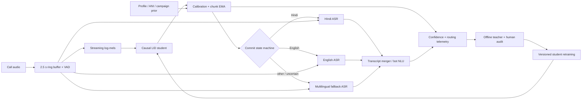

# Part 2 — streaming LID in a live ASR pipeline

The LID model should advise a stateful router, not directly restart ASR on every posterior peak. Audio is written once to a timestamped ring buffer; VAD, LID, and the active recognizer consume that same clock. This makes a routing decision reversible because a new recognizer can replay recent audio.



## Commit and calibration policy

Every 160 ms chunk produces a seven-way posterior from stable frame outputs. The streaming model retains its final four feature positions until their real right context arrives and emits each position once; zero-padded end-of-stream tail logits never enter the router. Apply temperature/vector calibration learned on speaker-disjoint, codec-matched calls, average the stable frames in the chunk, then update an EMA. An initial commit requires all three conditions: top posterior at least 0.60, top-minus-runner-up margin at least 0.10, and the same winner for three chunks (480 ms). Before that, the state is `UNKNOWN`; audio remains buffered and a multilingual recognizer may run in shadow.

The submitted thresholds are illustrative, not fitted on one synthetic switch. On a real development set I would grid-search threshold, margin, EMA constant, and dwell against expected business cost rather than accuracy alone:

```text
cost = C_wrong * P(wrong route) + C_wait * initial_latency
     + C_switch * switches/hour + C_miss * P(missed language).
```

Reliability diagrams and expected calibration error should be sliced by language pair, SNR, codec, utterance length, and prior. Select an operating point subject to hard bounds on false routes and p95 latency. A payment bot may wait longer than a low-risk FAQ bot. Model algorithmic latency here is 435 ms; EMA/dwell and evidence acquisition are separately visible in telemetry rather than being hidden in that number.

## Routing and the cost of changing ASR

At call start, retain at least 2.5 s of waveform. A strong prior may start one monolingual ASR speculatively, while weak confidence starts the multilingual fallback. On LID commit, send the buffered audio from the VAD onset to the selected ASR, so waiting does not delete the first words. Do not release irreversible bot actions until either the route is committed or the fallback transcript is stable.

Changing ASR is not a pointer swap. Decoder state, language-model context, endpointing, punctuation, timestamps, and partial hypotheses belong to the old recognizer. A switch therefore:

1. freezes already stable words before a protected overlap boundary;
2. starts the new ASR with roughly 0.8–1.5 s of buffered overlap;
3. re-decodes that overlap and merges by timestamps/token confidence;
4. retires the old ASR only after the new stream catches up.

Running both ASRs continuously reduces switch latency but roughly doubles inference cost. The preferred compromise is one active monolingual model plus a cheap multilingual shadow during `UNKNOWN` or suspected switches. A wrong early commit costs the original wait, new-model startup, overlap re-decode, and possibly a bad NLU action—often much more than another 200–400 ms of LID dwell.

## Code-switch hysteresis and measurement

Once active language `A` is committed, retain it until challenger `B` meets a stricter switch condition. The current example uses posterior ≥0.60, a ≥0.10 advantage over `A`, and three consecutive chunks. A failed chunk resets the challenger dwell counter; it does not immediately flip the active state. A short cooldown after switching and asymmetric thresholds for known hard pairs can reduce ping-pong. Silence does not vote: during non-speech, freeze or decay toward `UNKNOWN` rather than toward an arbitrary language.

For a hand-labelled boundary at `t_boundary`, switch lag is

```text
lag = t(first committed new-language decision) - t_boundary.
```

Use the audio-ingress clock, including chunk scheduling—not model frame indices. Report median/p90/p95 lag, miss rate within (say) 3 s, premature-switch rate, false switches per speech hour, and time spent on the wrong ASR. Negative raw crossings are premature detections, not “excellent lag.” In the submitted speaker-disjoint run, the student never satisfies the initial Hindi dwell and never commits English after the 4.000 s boundary; `switch_lag_ms` is therefore `null` and the case is a miss. It is not encoded as zero or an arbitrarily large lag. One synthetic boundary is only a wiring check.

## Low confidence, priors, and fallback

Convert a phone-number, customer-profile, campaign, or last-turn language prior into a calibrated log-prior and add it with a capped weight to LID log probabilities. Decay its influence after the first seconds of speech so acoustic evidence wins; never hard-lock a user based on ANI. Priors should be audited by cohort because an incorrect prior can systematically delay a switch.

If confidence/margin never passes policy, route to a multilingual ASR, keep buffering, and let ASR confidence plus LID make a joint decision. For high-value flows, ask a short language-choice reprompt. Treat high entropy, low energy, overlapping speakers, and low mass inside the supported-language set as `UNKNOWN`. A production student needs an explicit `other/unknown` class; the demo's seven-way renormalization cannot provide that safety signal.

## Teacher-relabel loop

Log consented, privacy-filtered segments when LID is uncertain, ASR confidence collapses after routing, two recognizers disagree, users correct the bot, or frequent switches occur. Preserve audio timestamps, LID trajectories, route changes, codec/SNR, and downstream outcomes. Offline, run the full-context teacher on VAD utterances for stationary speech and on local windows around suspected switches. Never apply one utterance label across a code-switch. Sample low-confidence/OOD cases for bilingual human audit; teacher labels are not ground truth.

Version audio recipes and hashes, teacher checkpoint, target parameters, calibration set, and policy. The demo's corpus builder binds text/provider/voice/options/client and generator identity to each byte-addressed WAV, validates the complete staged corpus, moves immutable audio first, and atomically swaps the manifest last; a failed refresh cannot partially rewrite the release named by the old manifest. Downstream stages fail closed on a changed target class order, manifest record, waveform hash, target-configuration/file-set hash, pinned teacher revision/artifacts, or target-generator source. Its schema-2 run identity begins with an immutable dependency snapshot captured before tensor preload. Manifest records and their hash come from the same byte read, target identity and metadata hash come from the same byte read, and the dataset consumes those captured records. Three live equality gates—before preload, before optimization, and before checkpoint publication—abort on a concurrent source, manifest/audio, target-metadata, or settings change. The final identity adds the model/checkpoint hash, complete frontend/model/delay/chunk configuration, and exact checkpoint-bound training metrics; evaluation validates every target and refuses mixed-run inputs before scoring. It does not yet solve the separate method flaw that linear interpolation between 250 ms teacher anchors extends most switch-target horizons beyond the student's evidence; release gating must reject such availability-contract violations. Training rejects any batch with no causally valid alignment, non-positive/non-finite run settings, and an optimizer update that leaves non-finite model or optimizer state. The submitted run records 1,600 requested, successful, and post-update-checked real-audio steps; a zero-gradient, corrupt update, or dependency race cannot become a published success flag. Retrain with a balanced mixture of recent hard cases and a fixed replay set, then gate release on per-language agreement, calibration, false switches/hour, switch-lag percentiles, and downstream ASR WER/task success. Shadow the candidate, canary a small call fraction, and retain rollback. This closes the loop without allowing the student's own mistakes to become self-confirming labels.
