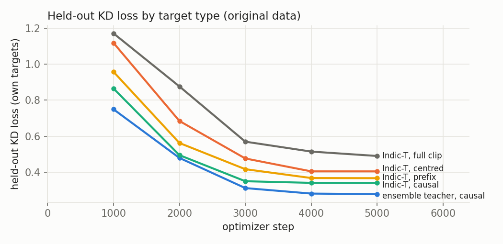
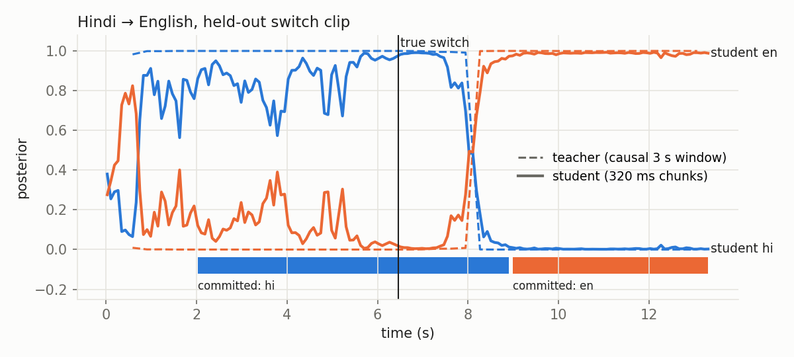

# Streaming language ID by distillation

Distil a frozen, full-context (offline) spoken-language-ID **teacher** into a small **causal, chunked student** that emits a language posterior every 80 ms from the audio heard so far. The target use is a Hindi↔English voice bot in India, plus Gujarati, Marathi, Bengali, Tamil and Telugu.

- **Part 1 (this file):** the implemented distillation.
- **Part 2 ([`DESIGN.md`](DESIGN.md)):** how the streaming LID plugs into ASR.

Run on one laptop (RTX 4050 6 GB for Indic-Transcribe and all training), with the slow Whisper teacher fanned out to Modal L4 GPUs. The required training step also runs on CPU (`--device cpu`).

## TL;DR

- **Teacher:** chosen by a measured bake-off of 5 offline LID models, then frozen. The winner is a **log-linear ensemble of Indic-Transcribe-core and Whisper-large-v3-turbo**, because their errors are complementary (section 2).
- **The asymmetry fix:**
  - The student at frame t is trained to match the teacher run on **only the last W = 3 s of audio the student has already heard** (a *causal window*).
  - That target is a function of the student's own input, so a perfect student can match it exactly. Nothing is asked of the student that needs the future.
  - It is the same as the "centred window + emit delay Δ = W/2" recipe, written down honestly (section 3).
- **Why it matters, measured:**
  - We trained the same student on 5 target types.
  - Future-informed targets (full clip, centred, hybrid) look **better** in the first second, but they identify the language **from pure silence** 62–73% of the time (chance 14%). They learned FLEURS recording conditions, because a target that depends on the future rewards any clue that predicts the future.
  - Every information-matched target (causal, prefix) is at chance on silence.
  - Full and prefix targets also miss 77–87% of language switches (section 3).
- **Student:** a 3.1M-parameter causal Conformer with 80 ms frames and chunked attention. Trained with random chunk sizes (80/160/320/640 ms), so one model serves 4 latencies.
  - **Real incremental streaming:** `StreamingSession.push(audio)` with a KV cache, tested equal to the batch forward.
  - Runs at ≤ 0.006× real time on one CPU thread.
  - Held-out: .89 accuracy at 2 s, .94 at clip end, .86 on simulated telephony, ECE .02, 88% frame agreement with the teacher.
- **Evidence:**
  - one real optimizer step, then 5,000 steps, all finite
  - held-out KD loss falls (0.75 → 0.28)
  - student-teacher agreement on held-out clips
  - a 5-way target comparison plus a silence-shortcut probe
  - switch lag split into teacher, student and commit-policy lag
  - a window-size (W) and turn-reset study
  - 12 unit tests (causality, streaming equivalence, commit policy)
- **Shipped model:** `checkpoints/final/student.pt` (12 MB, in the repo). Try `python scripts/stream_demo.py some.wav`.

## 1. Data (`scripts/prepare_data.py`)

| Set | Source | Size |
|---|---|---|
| Train, monolingual | FLEURS **dev** split, 7 languages × 200 clips | 4.2 h |
| Train, Indian English | AI4Bharat **Svarah**, 200 clips, speaker keys disjoint from eval | |
| Train, switches | 600 synthetic clips: 2–3 segments of 2.5–5 s; half hi↔en, rest random pairs | 1.4 h |
| Eval, monolingual | FLEURS **test** split, 7 × 60; Svarah 60 (other speaker keys) | 1.3 h |
| Eval, switches | 90 clips: ~4 s A + ~4 s B. Pairs: hi↔en (US), hi↔en-IN, and gu/mr/bn/ta/te→en | |
| Telephony | Every eval clip also scored after 300–3400 Hz band-pass, 8 kHz μ-law, 20 dB SNR noise | |

**Honest caveats:**
- **FLEURS:** train and eval use different sentences, but FLEURS publishes no speaker IDs, so speaker overlap is possible.
- **Svarah:** it has no speaker IDs either. We split on the (native language, state, district, gender, age group) tuple.
- **Switch clips:** they are synthetic concatenations, not real code-switching.

Real code-switched data (MUCS 2021, DISPLACE) is the obvious next step.

## 2. Teacher bake-off (`scripts/teacher_bakeoff.py`, `results/teachers/`)

Choosing the teacher was part of the task, so it is measured. Every teacher's native posterior is folded onto the routing set: Urdu merged into Hindi (they sound alike), and every other language summed into "other". It is then **restricted** (renormalised) to our 7 languages.

Accuracy on held-out clips (restricted), 480 clips:

| Teacher | 1 s | 2 s | 3 s | Full | Full, telephony | Indian English (full) | Hindi @2 s | Marathi | Telugu | ECE @3 s | ms/call |
|---|---|---|---|---|---|---|---|---|---|---|---|
| SpeechBrain VoxLingua107 ECAPA | .31 | .64 | .76 | .87 | .82 | .13 | .70 | .93 | 1.0 | .115 | 6 |
| NVIDIA AmberNet | .35 | .65 | .79 | .87 | .84 | .03 | .77 | .95 | 1.0 | .111 | 12 |
| TalTech XLS-R-300M VoxLingua | .36 | .66 | .82 | .92 | .90 | .38 | .82 | .97 | 1.0 | .061 | 390 |
| Whisper-large-v3-turbo (language token) | .28 | .41 | .49 | .61 | .57 | **1.00** | .73 | .33 | **.00** | .357 | 131 |
| Indic-Transcribe-core (Bodhan/AI4Bharat) | **.43** | **.81** | **.89** | .90 | .90 | .20 | **.95** | 1.0 | 1.0 | .068 | 11 |
| **Ensemble: Indic-T^0.7 × Whisper^0.3** | **.44** | **.85** | **.95** | **.95** | **.95** | **.63** | **.98** | 1.0 | 1.0 | **.030** | 11 + 131 |

**Findings that drove the choice:**
1. **Restriction matters on short audio.** At 1 s, 70–96% of every VoxLingua teacher's probability sits on languages outside our 7.
2. **The VoxLingua teachers (ECAPA, AmberNet, XLS-R) cannot recognise Indian-accented English** (3–38%). Their "English" is YouTube English. For an Indian voice bot this is disqualifying.
3. **Indic-Transcribe labels Indian English as the speaker's native language.** Marathi speakers' English comes out Marathi, Nepali speakers' Nepali, Konkani speakers' Konkani. It identifies the accent, not the language.
4. **Whisper is perfect on Hindi, English and Indian English** but misses Marathi, Gujarati, Bengali and Telugu (0–33% on full clips).
5. **So the two best teachers fail on opposite cases.** The ensemble is log q ∝ w·log q_IndicT + (1−w)·log q_Whisper over the routing set.
   - *w* is tuned on 25 clips per group from the **training** pool (never eval), by the mean NLL of the true language over 1/2/3 s + full, clean + telephony: **w = 0.7** (NLL 0.61 vs 1.07 for Indic-T alone; `results/teachers/ensemble_tuning.json`).
   - On held-out eval it is the best teacher on every column except Indian English at 1 s, and it's the most stable as the prefix grows (clips whose argmax flips more than once: 10% vs 32%).
   - Whisper's 131 ms/call was run on Modal L4s (`scripts/modal_whisper.py`). The Modal and laptop results agree to within 0.002.

**Also not used as teachers:**
- **Nemotron 3.5 ASR:** among our languages it covers only hi and en, and it emits the language tag only after a finished transcript.
- **MMS-LID:** CC-BY-NC licence and ~1B parameters.

**Licence flag:** Indic-Transcribe's licence is share-alike, needs sign-off for hosting as a service, and forbids robocall/auto-dialer use. A voice-bot company must clear this before distilling it into production.

## 3. The asymmetry: what the student is asked to match, and why

**Notation:**
- e(t) is the last input sample that student frame t depends on (`slid/student.py:frame_end_sample`).
- The student's posterior at frame t is p_θ(· | x[0:e(t)]).
- The target is q_t = T(V_t(x)), the frozen teacher applied to a *view* V_t of the clip.

**Objective** (`scripts/train.py:kd_loss`):

    L(θ) = E_x  mean_t  KL( q_t ‖ p_θ(· | x[0:e(t)]) )
         = E_x  mean_t  [ −H(q_t) − Σ_k q_tk log p_θ(k | x[0:e(t)]) ]

Only the cross-entropy term depends on θ. Cross-entropy is a strictly proper scoring rule, so over all functions of the student's input the minimiser is the **conditional expectation of the target given what the student has heard**:

    p*(· | x[0:e(t)]) = E[ q_t | x[0:e(t)] ]

The loss left over at that optimum is E[ KL(q_t ‖ E[q_t | x[0:e(t)]]) ]. This is **zero if and only if q_t is a function of x[0:e(t)]**, i.e. the teacher's view is inside the student's view. That one condition sorts the options:

| View V_t (`slid/targets.py`) | Inside the student's view? | What the optimal student learns |
|---|---|---|
| **full:** x[0:N] | No | E[whole-clip label ∣ prefix]: a *forecast* of the clip's final answer. On one-language audio that forecast is well defined and calibrated. On a switch clip it can only learn "the language this clip will end up being", so it cannot follow a switch. |
| **centred:** x[e−W/2 : e+W/2] | No (W/2 of future) | A forecast of the next 1.5 s. When the next 1.5 s is the same language (almost always), that is a *better* label than the teacher on short audio. Across a switch it rewards jumping on the first hint of a new language. |
| **prefix:** x[0:e] | Yes | The teacher exactly, including its weakness on short audio. After a switch the teacher still hears all the earlier audio, so the *target itself* is slow to switch. |
| **causal (ours):** x[e−W : e], W = 3 s | Yes | The teacher exactly (again inheriting its short-audio weakness), **and** it forgets audio older than 3 s, so it can follow a switch. |

The leftover term is not "the student is wrong". It measures the future information the target demands. Whether that hurts depends on whether the future is *predictable from the past*. On one-language audio it is (the language doesn't change). Across a switch it is not. The ablation below measures exactly this.

**Connection to the "emit delay" recipe.** The causal window ending at e(t) is the centred window of the frame W/2 earlier. So training on causal targets means reporting the teacher's centred decision about time t − W/2 at time t: an **emit delay Δ = W/2 = 1.5 s** that is built into the target, not a separate knob. Shrinking W trades less lag for noisier targets, since the teacher is weaker on short audio (see the bake-off).

**Weighting and temperature:**
- **No per-frame down-weighting.** With information-matched targets, early frames already have high-entropy targets, so there's no need to hand-tune "don't trust early frames". The first target is placed after 0.4 s of audio because a 0.1 s teacher call is meaningless.
- **Temperature T = 1.** The targets are already soft and calibrated (ECE in the bake-off). Sharpening or smoothing them would break the calibration that the Part 2 commit threshold relies on.

### Measured: 5 target types, same student, teacher, data and steps

Setup: Indic-T teacher, 5,000 steps, telephony augmentation on, 320 ms chunks. `checkpoints/indic-transcribe_<kind>/eval.json` and `results/ablation/`. "Hybrid" = whole-clip targets on one-language clips, causal targets on multi-language clips.

| target | acc @1 s | ECE @1 s | acc end | telephony end | switches missed (of 90) | correct *before* the switch | raw switch lag (median) | raw flips/min |
|---|---|---|---|---|---|---|---|---|
| full | .75 | .047 | .85 | .77 | **78** | .61 | 3.03 s | 46 |
| prefix | .62 | .113 | **.89** | .80 | **69** | .73 | 2.67 s | 40 |
| **causal** | .58 | .117 | **.89** | **.83** | 41 | .69 | 2.18 s | **39** |
| centred | **.81** | **.034** | .85 | .75 | 42 | .71 | **1.10 s** | 47 |
| hybrid | .75 | .047 | .88 | .74 | **38** | .68 | 2.11 s | 51 |

The same students under the commit policy, compared at **equal wrong-commit rate** (sweep over θ, `results/ablation/commit_sweep_*.json`):

| target | θ | first correct commit | wrong first commit | committed switch lag | switches missed |
|---|---|---|---|---|---|
| causal | 0.8 | 1.71 s | 6.5% | 2.03 s | 47% |
| centred | 0.8 | **0.82 s** | 5.8% | **1.62 s** | 57% |
| hybrid | 0.9 | 1.15 s | 5.0% | 2.38 s | 75% |

**What this shows:**
1. **The theory's warning is real, and it is about switches.**
   - Targets that cannot follow the local language miss most switches: full misses 78/90, because the one clip label is wrong for half the clip; prefix misses 69/90, because it can't forget.
   - Only local targets (causal, centred) track them.
2. **Information-matching has a price: the student inherits the teacher's short-audio weakness.**
   - At 1 s the causal target is "the teacher on 1 s of audio", and the teacher is 44% right and poorly calibrated there.
   - The centred target at 1 s is the teacher on ~2.5 s. It peeks at the future, but at call start the future is almost always the same language, so the label looks better: 2× faster first commit at equal error. (The silence test below shows part of this is a shortcut.)
3. **The peek is not free:**
   - More switches are missed at strict thresholds.
   - More raw flips: it learns to jump on the first hint of a new language.
   - It is less robust on telephony (.75 vs .83).
   - These are the costs the theory predicts wherever the future is *not* predictable from the past.
4. **Hybrid is dominated by centred** at every threshold, so we drop it.

### The decisive test: can the student name the language from silence?

`scripts/silence_test.py` feeds each student **only the leading silence** of held-out clips (118 clips with ≥ 0.45 s of silence before speech). There is no language in it, so chance is 1/7 = .14.

| student (target type) | accuracy on silence |
|---|---|
| **final: ensemble teacher, causal** | **.09** |
| Indic-T causal | .14 |
| Indic-T prefix | .10 |
| Indic-T full clip | .62 |
| Indic-T hybrid (full-clip targets on 1-language clips) | .68 |
| Indic-T centred | .73 |
| ensemble teacher, centred | .64 |

**Every future-informed target learned to recognise the language from recording conditions** (FLEURS records each language in its own sessions). **Every information-matched target stayed at chance.**

This is the leftover term of §3 in action:
- The optimal student is E[q_t | heard audio]. When q_t depends on audio not yet heard, the student lowers its loss by exploiting *anything* in the heard audio that correlates with the future label, including artefacts.
- When q_t is the teacher's answer on the heard audio, the teacher is itself uncertain on silence, so there's nothing to exploit.
- Much of the future-informed students' "better first second" is this shortcut, which would not transfer to real calls, where the phone line doesn't reveal the language.

### Final choice, on the ensemble teacher

Same student and teacher, 320 ms chunks, held-out:

| | causal (**shipped**) | centred |
|---|---|---|
| acc at 0.5 / 1 / 2 s | .20 / .57 / .89 | .79 / .88 / .92 |
| acc at clip end / telephony end | **.94 / .86** | .90 / .79 |
| ECE at end | **.022** | .046 |
| first correct commit at ~7% wrong | 1.78 s (θ .8) | 1.06 s (θ .9) |
| hi↔en committed switch lag / premature switches | 2.42 s / **8%** | 1.52 s / 15% |
| accuracy on silence (chance .14) | **.09** | .64 |

**We ship causal.** Centred's speed is partly a shortcut. The honest ways to get speed back (shorter W, per-turn reset) are measured in DESIGN §4.

## 4. Student and latency budget (`slid/student.py`)

**Architecture:**
- 80-bin log-mel, 25 ms window, 10 ms hop, `center=False`.
- **Global** CMVN: per-utterance normalisation would leak future audio into every frame.
- 3 causal stride-2 convolutions give 80 ms frames.
- 6 Conformer blocks: d = 144, 4 heads, FFN 576, causal depthwise conv with kernel 15, LayerNorm instead of BatchNorm.
- Linear head over the 7 languages. 3.06M parameters.
- **Shipped (v1):** unlimited attention history and absolute sinusoidal positions. In streaming the KV cache grows by ≈7 kB per 80 ms frame (all layers), i.e. ~50 MB for a 10-minute call, which is fine for phone calls.
- **Constant-memory variant (v2, in the code, not shipped):** history bounded to 64 or 128 frames (5.1 / 10.2 s) plus a learned **relative position bias** instead of absolute positions. Memory is constant forever, but on the same recipe it lost accuracy:

  | | end acc | telephony end |
  |---|---|---|
  | v1 | .94 | .86 |
  | v2, 5.1 s | .87 | .80 |
  | v2, 10.2 s | .84 | .74 |

  Longer v2 history did *not* help, which points at the missing absolute position rather than the history bound. Our hypothesis: absolute position lets the model know how long it has been listening, and the causal targets are systematically less certain in the first 3 s. A "time since stream start" feature is the fix we'd try next.

**Causality:**
- Convolutions are left-padded.
- Self-attention uses a **chunk mask**: a frame sees its own chunk and earlier frames (up to the history bound). So the lookahead is bounded by the chunk no matter how many layers are stacked. With a per-frame "1 frame ahead" mask, layer 2 would read layer 1's output at t+1, which had already seen t+2, so the lookahead would grow by one frame per layer.
- The decision is read at the last frame of each chunk.
- `tests/test_student.py` checks that perturbing audio after a chunk ends leaves every earlier output bit-identical, for chunk sizes 1/2/4/8.

**Real incremental inference** (`slid/streaming.py`): `StreamingSession(model, chunk).push(samples) → posteriors`. It keeps only:
- raw audio for the front end's 14-mel-frame receptive field (< 0.3 s)
- per layer, a **key/value cache** (all past frames for v1; the last 64/128 for v2)
- per layer, the last 14 inputs of the causal depthwise conv

**Memory per call:**
- **v2:** memory and compute per chunk are constant, so there's no maximum call length.
- **v1 (shipped):** memory grows linearly, about 50 MB for 10 minutes.

`tests/test_streaming.py`:
- **Equivalence**, for **both** v1 and v2: audio pushed in random 100–5,000-sample pieces gives the same posteriors as the whole-clip forward (to 1e-4), for every chunk size.
- **Constant memory (v2):** 2 minutes of audio run with a constant-size cache and audio buffer.
- **Demo:** `scripts/stream_demo.py` feeds a wav in 20 ms packets and prints routing decisions as they happen.

**Latency** (why this architecture):
- **Algorithmic latency** = 25 ms window + one chunk of buffering: 80 / 160 / 320 / 640 ms at chunk 1 / 2 / 4 / 8. The default operating point is 320 ms.
- **Compute** = 0.002–0.006× real time on one CPU thread (a 10 s clip in 17–55 ms). Per-call cost is negligible next to ASR, so **the latency budget is set by evidence, not compute**: the commit policy (Part 2) waits for enough speech to be confident.
- **Dynamic chunk training:** chunk size is re-drawn every batch from {1,2,4,8}. One model serves every operating point, and section 5 reports accuracy per chunk: the latency/accuracy curve comes for free.
- **Why not a GRU or TCN:** a GRU is causal but has no bounded lookahead to trade. A TCN has lookahead that grows with depth. The chunked Conformer is the standard streaming-ASR encoder (U2/WeNet, NeMo cache-aware), so it could share a front-end with the production ASR.

## 5. Sanity checks and results

The final model is the **ensemble teacher + causal targets + telephony augmentation**, v1 architecture, 5,000 steps (`checkpoints/final/`; copies of `eval.json` and `train_log.json` are in `results/final/`).

**The plumbing works:**
- **Step 1:** loss 1.99, grad-norm 8.8, finite.
- **All 5,000 steps finite:** training raises on a non-finite loss.
- **Training KD loss:** 1.76 (first 10 steps) → 0.22 (last 10).
- **On 570 held-out clips** (eval + switch), with the student's own target type:

  | step | 1k | 2k | 3k | 4k | 5k |
  |---|---|---|---|---|---|
  | held-out KD | 0.750 | 0.480 | 0.313 | 0.283 | **0.279** |
  | held-out argmax agreement with teacher | .69 | .81 | .87 | .88 | **.88** |



Each curve is measured against *its own* targets, so the plateau height is the part of that target the student cannot learn. The order matches §3: the whole-clip target (needs the most future) plateaus highest, then centred, then the information-matched ones. The ensemble target is the most learnable of all.

- **Unit tests:**
  - causality: `tests/test_student.py` checks that perturbing audio after a chunk ends leaves earlier outputs unchanged, for every chunk size
  - frame and target alignment
  - commit-policy behaviour (`tests/test_commit.py`)

**The student as a stream, held-out (480 monolingual clips).** Accuracy on the 7 routing languages at time t after the start (wall-clock, so chunk buffering is included):

| chunk (lookahead) | 0.5 s | 1 s | 2 s | 3 s | end | end, telephony | ECE (end) | agreement with teacher |
|---|---|---|---|---|---|---|---|---|
| 80 ms | .16 | .48 | .90 | .95 | .94 | .87 | .022 | .88 |
| 160 ms | .17 | .52 | .89 | .95 | .94 | .87 | .030 | .88 |
| **320 ms** | .20 | .58 | .89 | .95 | .94 | .86 | .022 | .88 |
| 640 ms | .24 | .59 | .90 | .95 | .94 | .86 | .029 | .88 |

**Reading it:**
- **Longer chunks only help in the first second.** From 2 s on, the 80 ms setting is as good as 640 ms. So the latency knob can sit at 80–320 ms at almost no cost, and the time to a decision is set by *evidence* (≈1.5–2 s of speech), not by lookahead.
- **At 1–2 s the student beats its teacher.** Teacher run on a 1 s prefix: .44, vs .58 for the student at 1 s. The student has seen thousands of in-domain windows; the teacher has only the clip.
- **Telephony augmentation** (half the training clips degraded, target = teacher on the *clean* audio) is what makes the telephony column possible. Without it the same recipe scored **.14** on telephony (.89 clean). With it: .86 telephony, .94 clean.
- **Indian English at 2 s:** .72 (clean) with the ensemble teacher vs .15 with Indic-T alone. The student inherits its teacher's blind spots, which is why the teacher was chosen by measurement.

**Switch detection, Hindi → English** (10 held-out clips, 320 ms chunks, medians). Each row is one of the three lags, measured from the true switch:

| | lag |
|---|---|
| teacher (causal 3 s window) | 2.46 s |
| student, raw argmax | 2.26 s |
| student, committed (θ 0.7, dwell 240 ms) | 2.83 s |

- **Flip-flops:** the raw argmax makes 17 extra label changes per minute; the committed label makes 1.9.
- **Where the lag comes from:** mostly the target. A 3 s causal teacher window only says "English" once most of the window is English (≈1.5–2.5 s). The student is on average slightly *faster* than its own target, and the commit policy adds ≈0.5 s. See `results/figures/switch_trace.png`.
- **Hindi → Indian English is the weak spot:** 7/10 committed switches missed, because the teacher itself is only .63 on Indian English.



**Compute:** 3.06M parameters. On one CPU thread a 10 s clip takes 17–55 ms (RTF 0.0017–0.0055, depending on machine load; `eval.json`), i.e. well under 1 ms of compute per 80 ms frame.

## 6. Reproduce

```bash
uv venv --python 3.10 .venv
uv pip install --python .venv/bin/python torch torchaudio --index-url https://download.pytorch.org/whl/cu126
uv pip install --python .venv/bin/python -e . speechbrain transformers sentencepiece safetensors pyarrow tqdm
# accept the licences for bodhan-ai/indic-transcribe-core and ai4bharat/Svarah on Hugging Face, then `hf auth login`
# quick look at the shipped model (no data or teacher needed):
python scripts/stream_demo.py your.wav                      # 16 kHz mono wav; prints routing decisions
pytest -q                                                   # 12 tests

# full pipeline
python scripts/prepare_data.py                              # FLEURS + Svarah, manifests, switch + mix clips
for t in ecapa ambernet xlsr-voxlingua whisper-turbo indic-transcribe; do
  python scripts/teacher_bakeoff.py --teacher $t; done      # Whisper: `modal run scripts/modal_whisper.py::main` instead
python scripts/teacher_bakeoff.py --teacher indic-transcribe --manifest train --max-per-lang 25 --no-switch
python scripts/ensemble.py tune && python scripts/ensemble.py score           # w on the train pool
python scripts/build_targets.py --teacher indic-transcribe --kinds causal     # + prefix centered full for the ablation
modal run scripts/modal_whisper.py::main --targets-only                       # Whisper causal targets on L4s
python scripts/ensemble.py targets --kind causal
python scripts/train.py --teacher ensemble --kind causal --left-frames -1 --rel-pos 0 --out checkpoints/final
python scripts/eval_student.py --ckpt checkpoints/final/student.pt --teacher ensemble
python scripts/commit_sweep.py && python scripts/turn_reset.py && python scripts/silence_test.py
python scripts/figures.py
```

## 7. Implemented vs. not

**Implemented and run:**
- teacher interface for 5 teachers
- the bake-off
- the ensemble
- 5 target types
- the student
- training with a NaN guard and telephony augmentation
- **incremental streaming inference with a KV cache** (tested equal to the batch forward)
- streaming evaluation with a runnable, swept commit policy
- unit tests (12)

**Stubbed or not done:**
- **Real code-switched evaluation data:** switches are synthetic concatenations.
- **Training to convergence** on hundreds of hours.
- **A per-call language cache** (Sortformer-style) in the student; see DESIGN §7.
- **Export** (ONNX/TorchScript) of the streaming session.

**With more compute:**
- ~1k hours of IndicVoices + MUCS + Svarah-style accented English, relabelled by the ensemble teacher
- real 8 kHz call-centre audio instead of simulated telephony
- a fuller sweep of the teacher window W (we measured 1.5 s vs 3 s) and a two-timescale student
- calibration (temperature scaling) checked on real calls
